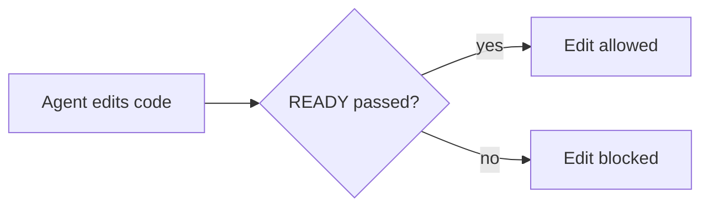

# Story Gate Protocol (any AI client)

Every code change belongs to a story. A story starts on defined specs, is built and tested against them, and ends on them. It passes **READY** before code is written, **CHECKPOINTS** while it's being built, and **DONE** before the work is called finished. Agents collect the evidence; `gate.py` makes the call. Never declare a gate passed yourself. Quote the line `gate.py` prints.

`gate.py` means **`story-gate`**, the verified copy installed on this computer; run it anywhere inside the repository. If `story-gate` isn't found, use the full command story-gate's messages print. Only where story-gate isn't installed (cloud agents, where hooks don't run) use `python3 .story-gate/gate.py` (`python` on Windows) from the repo root. With story-gate installed, the hooks refuse running the repository's copy, because a branch can replace it.

**Who decides what:**

| Role | Decides |
|---|---|
| You, the agent | Gather evidence |
| The **judge** (Jev by default, see `config.json` → `judge`) | Scores the evidence |
| `gate.py` | Applies fixed rules |
| **CI** | Re-checks everything on GitHub |
| **A human code owner** | Accepts the work by approving the PR's latest commit, then merges it |

**You never:** approve, merge, waive or decide drift on a human's behalf. You never act with a human's GitHub login: use the agent identity (`gate.py agent-env`).

**Mode** (`.story-gate/config.json`):
- `"mode": "warn"` reports problems without blocking.
- `"mode": "enforce"` blocks edits, stopping and merging.
- `enforce_points` turns on blocking one point at a time (`pre_edit`, `checkpoint`, `stop`, `ci`) while mode is still `warn`.

**Sub-agents:** if your client can spawn them, run the steps marked ∥ in parallel. `config.json` → `models` names a **tier** per step:
- `small` = the cheapest fast model your client offers.
- `medium` = its mid-tier coding model.
- Never use a frontier model for gate work.

If your client can't spawn sub-agents, or can't pick their model, do the steps yourself in order. Judging is always done by Jev through `gate.py`, so your client's model choice doesn't change the verdict.

---

## READY (before any code)

0. If the story isn't in the backlog yet, a human or orchestrator adds it: `gate.py plan <ID> --title "..." [--feature F]`. Starting it is your claim, and the dashboard shows it against your client and model.
1. `gate.py start <ID> --model <your model id>` creates `.story-gate/stories/<ID>/`, makes `<ID>` the active story and records which client and model is coding (a judge from the same model family never counts).

2. **Intake** (model: `intake`). Fetch the story from the source in `config.json` → `sources`:
   - Linear issue, repo file, control-hub document, or a `command` source (`gate.py source <ID>`).
   - Write it **verbatim** into `story.md`. Fill the front matter: `source`, `depends_on`, `consumers`.
   - Don't improve the story here. Gaps are findings, not something to fix silently.

3. ∥ **Context** (model: `context`). Fill `context.md`, quoting only relevant excerpts, each with its source:
   - `## PRD`: the PRD sections this story serves.
   - `## TRD`: the architecture and technical rules it must follow.
   - `## Upstream handoffs`: one `### <dep-id>` block per `depends_on`. Use that story's `handoff.md`, or the equivalent from Linear or control-hub.
   - `## Prior learnings`: run `gate.py learnings <3-6 keywords>`, then paste the relevant hits with their ids. If nothing fits, write `None — searched: …`.
   - **Spec pinning:** PRD/TRD files listed in `config.json` (`spec_files`, or a `repo` source's `prd`/`trd`) are fingerprinted at READY. If they change mid-story, READY goes out of date: re-run READY and reconcile.

4. ∥ **Test plan** (model: `tests`). Fill `tests.json`:
   - Add one entry per acceptance criterion.
   - Each entry needs concrete `positive`, `negative`, `edge` and `regression` cases. For any category that truly doesn't apply, put a reason under `not_applicable.<category>`.
   - Never invent or rewrite acceptance criteria. Put suggestions in `proposed_missing_acs`.
   - Leave `test_refs` empty for now. They're filled during DONE.

5. `gate.py score <ID> ready`. Jev scores 14 semantic checks plus the drift direction. The structural checks are deterministic.

6. Act on the result:
   - **PASS**: start coding.
   - **CONCERNS** or **FAIL**: show the owner the failing lines (one table: check → why → proposed fix).
     - Fix the story at its **source** (Linear, PRD repo, etc.) only with the owner's OK.
     - Then copy the change into `story.md` and re-score.
   - **ESCALATED**: see *Drift* below.

## Drift (spec vs story): never resolved silently

When `drift_decision` is ESCALATED, `gate.py` has already queued a `story_gate.drift_escalated` event for the sinks. Then:

1. Write `stories/<ID>/drift.md` with four parts:
   - What differs (quote both sides).
   - Since when. Use `git log` on the PRD/TRD and the story history.
   - Who or what changed it. Name the session, commit or decision, if known.
   - The options: change the story, change the PRD/TRD, or split the work.
2. Send it to the **orchestrator / architect** and to the **session that owns the conflicting change**. Use the channels configured as sinks (Linear comment, control-hub event, command or webhook) and the owner's HANDOFF.md.
3. If there are real options to weigh, list them in plain English, each with pros and cons, and give your recommendation. If your client has a multi-model review skill, run the options through it first.
4. The human owner or the architect decides. Record it:
   `gate.py decide <ID> --drift story|spec|none --by <who> --note "<why>"`
5. Apply the decision at the source: update the PRD/TRD, or update the story. Then re-score.

## CHECKPOINTS (while coding): keep course, contain drift

`gate.py checkpoint <ID>`: Jev reads the story, the test plan and the diff so far, then reports:
- `ON_TRACK`, `AT_RISK` or `OFF_COURSE`.
- An **estimated** % complete: the average of the per-AC "implemented" probabilities. Use it as a progress signal, not a contract.
- Per-AC status: done, partial or todo.
- Drift, scope creep, TODO/deferrals, and whether tests are keeping pace with the code.

**When it runs:**
- **Automatically** every `checkpoint.every_edits` code edits (default 10) in clients with after-edit hooks: Claude Code, Codex, Cursor, Gemini CLI. The result is fed back to the coding model.
- **Manually** elsewhere (Windsurf, Grok, Muse, Cowork): after finishing each acceptance criterion, before any large refactor, and at least every ~30 minutes of work.

**How to act on it:**
- **ON_TRACK:** continue. Mention the % line in your progress updates.
- **AT_RISK:** fix the named cause now (write the lagging tests, remove the TODO, re-read the AC), then continue.
- **OFF_COURSE:** stop adding code.
  - If the work drifted, correct it and re-run `checkpoint`.
  - If the story or spec is the problem, follow *Drift* and record `gate.py decide <ID> --phase build ...`.
  - With `checkpoint` in `enforce_points`, code edits are blocked until one of those happens.

Checkpoints are appended to `stories/<ID>/checkpoints.jsonl` and published as `story_gate.checkpoint` events. That gives a dashboard live progress per story.

## DONE (before saying "done")

1. `gate.py record-tests <ID>` runs the pinned `test_command`.
   - Set `junit_path` too, so each test's own result is recorded.
   - The tests must be green on the current code.
   - CI repeats this run itself and ignores the local record. The local run is an early warning; CI's run is the proof.

   **Traceability:**
   - In `tests.json`, set each acceptance criterion's `test_refs` to the exact names of the automated tests that cover its cases (e.g. `test_ac1_expired_token_401`).
   - DONE fails any criterion whose tests are not in the current test files (`test_globs`), or, when JUnit is available, did not run and pass.
   - `trace.md` is written for reviewers: AC → planned cases → tests → result.

   **Self-review before the PR:** run your client's code reviewer on the diff and fix what it finds.
   - In Claude clients, that's `/engineering:code-review`.
   - This is a self-check. The proof comes from independent review on the PR: a code owner's approval of the latest commit, or a review of it from anyone listed in `config.json` → `reviewers`. Threads opened by those listed reviewers must all be resolved.

2. **Show it working (scenarios).** Run the feature the way a user would, once or more for every acceptance criterion, and record each run:
   ```
   gate.py scenario <ID> --name "wrong password is refused" --ac AC-2 --exit 1 --expect "wrong password" -- python app.py login --user ann --password nope
   ```
   - Use the real program: the command line, an HTTP call (`curl`), a script that drives the page (Playwright), or an end-to-end test. Don't use a unit test alone: the judge and the reviewers see what each scenario runs.
   - `--expect` is text (a regular expression) the output must contain. `--exit` is the exit code you expect (default 0). One run can cover several criteria (`--ac AC-1,AC-3`).
   - story-gate runs the command without a shell, with a time limit (`--timeout`, default 120 seconds), and keeps the last 4,000 characters of output with known secret shapes removed. Use test data, never real accounts.
   - Write output files to a temporary folder or an ignored path. A run that creates or changes files in the repository does not count.
   - Every recorded scenario must pass on the current code. Remove one that no longer applies with `gate.py scenario <ID> --name ... --remove`.
   - **CI runs every scenario again** on the PR's code, in the job with no secrets. For the PR, only CI's runs count.
   - If a scenario can't run in CI (it needs a desktop app, a device or a paid service), add `--local-only "<reason>"`. Your run then counts, but DONE in CI is CONCERNS, which blocks the merge unless the owner turned on `accept_concerns`. Prefer a scenario CI can run (headless browser, test double).
   - After any code change, run `gate.py scenarios <ID>` to run them all again.
   - When a scenario finds a bug: fix it, run the scenario again, and list the bug in validation.md.

3. ∥ **Validation writer** (model: `handoff`). Fill in `stories/<ID>/validation.md` (`start` creates the template). The owner reads it to decide if the story is done:
   - Sections: Result · Acceptance criteria · Scenarios run · Bugs found and fixed · Lessons learnt · Known limits · Demo.
   - **Demo:** steps the owner can follow to try it (what to open, what to type or click, what they should see). For an internal change with nothing to see, write `Not demo-able: <reason>`.
   - Write plain English (see **Writing**). Report only what happened. The CI check shows the scenario results next to it.
   - **Screenshots** (for anything a person sees): `gate.py evidence <ID> shot.png --scenario "<scenario name>" --caption "…"`. PNG or JPEG, 300 KB each, 10 per story. They show on the validation page, marked as reported.

4. ∥ **Handoff writer** (model: `handoff`). Write `stories/<ID>/handoff.md` in plain English (see **Writing**):
   - Sections: What changed · Interfaces and contracts · How to verify · Known limits · Downstream consumers · Release and rollback (or "Not applicable: reason") · Drift decisions.
   - Downstream stories read this. Write it for a stranger.

5. ∥ **Learnings recorder** (model: `learnings`). Record every error hit, wrong turn and reusable insight:
   - `gate.py learn <ID> --type error|learning|pattern --summary "…" --root-cause "…" --rule "<what future agents must do>" --tags a,b --client <your client>`
   - If nothing was learned: `--type none --summary "no new learnings"`.
   - Rules repeated 3+ times are flagged by `gate.py learnings`. Promote those into AGENTS.md / CLAUDE.md, with the owner's OK.

6. `gate.py score <ID> done`. This checks the diff against the story and TRD, the tests against the plan, traceability, scenarios for every acceptance criterion, validation.md, deferrals, handoff quality and learnings. Act on it as in READY.

7. **Show the owner.** Run `gate.py report <ID> --open`. It builds one HTML page: the verdicts, every AC with its scenario runs, the screenshots and validation.md. Each fact is marked *checked* (CI or story-gate) or *reported* (you).
   - If the change can be demoed, show the owner that page (open it, or attach the file). In chat, say in 2 or 3 lines what now works.
   - If it can't be demoed, validation.md is enough. Point the owner to it.

8. `gate.py publish` sends events to the configured sinks (control-hub, webhook, custom command).

9. Notify the downstream consumers listed in `story.md` that the handoff is ready, using the same channels.

## ACCEPTANCE (the human's part)

1. Push the branch and open a PR **as the agent identity**, with the story id in the branch name or a leading `[ID]` in the title.
2. The `story-gate` check runs:
   - It runs the pinned tests itself, then re-scores READY and DONE with the judge.
   - It checks that the independent reviewers have no open threads.
   - It shows the evidence in the check summary.
3. A **code owner approves the latest commit** in GitHub's own review screen. A comment is not an approval, and any new push cancels the approval. Then the human merges.
4. After the merge, an audit job opens an issue if anything was merged without that approval.

## Writing (plain English for a non-coder)

The person who accepts the work may not be a coder. Write so that they can read it once and understand it.
This applies to your chat replies, PR descriptions, the story's `## Plain summary`, `validation.md`, `handoff.md` and learnings.

**Rules** (STE-style: based on the ideas of ASD-STE100, not certified to it):
1. Keep each sentence short. An instruction has 20 words or fewer. Any other sentence has 25 words or fewer.
2. Write one instruction or one idea in each sentence.
3. Use the active voice. Write "The hook blocks the edit", not "The edit is blocked by the hook".
4. Use plain, common words. Use the same word for the same thing every time.
5. Keep paragraphs to 6 sentences or fewer. Use lists and tables for steps and comparisons.
6. Start with the result, then give the reason.
7. Explain a technical term the first time you use it, in five words or fewer.

**Diagrams:** use a diagram when it is clearer than text: a flow, a sequence of calls, how parts connect.
Use a fenced ```` ```mermaid ```` block. GitHub draws it. Example:



When a change touches several parts (`config.json` → `writing.diagram_min_files`, default 5 files), put a diagram in `handoff.md`.

**Do not rewrite:** the story text you copied word for word, quotes from the PRD or TRD, code, commands, file names and the `gate.py` verdict line.

**The score:** `gate.py score` measures rules 1 and 5 on the plain summary (READY) and on the handoff and learnings (DONE).
It is the share of sentences that pass (`config.json` → `writing.target`, default 0.8). The CI summary also scores the PR description.
It is advice. It blocks only when the owner sets `writing.enforce` to `true`, after calibration on about 20 stories.

## Waivers and drift decisions are proposals
- **Recording them:** `gate.py waive <ID> <check> --by <who> --reason "…"` and `gate.py decide …`. Each one is tied to the exact evidence it was made on.
- **What CI does with them:** CI ignores them until a code owner approves the commit that contains them. The check summary lists them, so the approver sees exactly what they are accepting.
- **What can't be waived:** structural facts.

## Tuning
- `gate.py label <ID> ready|done correct|wrong --note "…"` records whether a verdict was right.
- Thresholds are tuned from `calibration.jsonl`.
- A non-Jev judge stays capped at CONCERNS until it passes `gate.py judge-calibrate` and the owner sets `judge.emulated_allow_pass`.

## Rules
- Fail closed. If the judge is unavailable, the verdict can't be PASS. Say so; don't work around it.
- Never edit `.story-gate/` code, config or verdict files, CODEOWNERS or the story-gate workflows, with any tool, including the shell.
- Never run the human-only commands (`install`, `install --user`, `uninstall`, `enroll`, `unenroll`, `upgrade`, `rollback`, `release-sign`, `setup-repo`, `setup-agent`, `judge-calibrate`, `filter`, `lockdown`, `hook-trust`), and never touch the story-gate runtime in the user folder, your tool's user-level hook settings, or git's filter settings (`.git/info/attributes`, `filter.storygate-hooks`).
- Don't edit `ready.json` / `done.json` by hand. Don't delete `decisions.jsonl` or `learnings.jsonl` lines (append-only).
- Quote the `gate.py` verdict line in your reply. Never paraphrase it into a pass.
